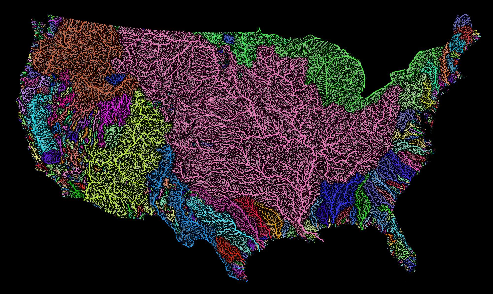

# EDS223 Homework Assignmnet 1: Map making practice

<p align="center">
  
</p>

This repository contains the materials for the [first homework assignment](https://eds-223-geospatial.github.io/assignments/HW1.html) for [EDS 223: Geospatial Analysis and Remote Sensing](https://bren.ucsb.edu/courses/eds-223), a course that is part of the Master of Environmental Data Science program completed at the Bren School of Environmental Science and Management.

The homework assignment focuses on the environmental injustice the Oahu population face living on the island by analyzing the intensity of toxic chemicals released in the air and the location considered to be at high risk of cancer. The toxic chemicals were determined by the Environmental Protection Agency's Toxics Release Inventory (TRI) Program.

## Folder Organization

The **folders** are organized as the following:

```
EDS223-HWK1 
├── data
│   └── ejscreen
├── image
├── ej_screen.qmd
├── ej_screen.pdf
└── README.md
```

Inside the **data** folder, there is a folder titled **ejscreen** that houses all necessary codes to replicate a map for any of the states in the U.S utilizing the data from this dataset. Inside that folder, there is a **EJScreen technical documentation** that describes the datasheet with detailed information on how it is structured regarding the data, as in what each column signifies and how it was calculated as well as where the data was sourced from. Then there is a **.xlsx** file that is the main dataframe.

The original work

## Contributer
The author for this homework assisgnment on map-making is Monique Hernandez.

## References

"EJScreen Technical Documentation", U.S. Environmental Protection Agency (EPA), 2022.[Accessed: Oct. 3, 2026]